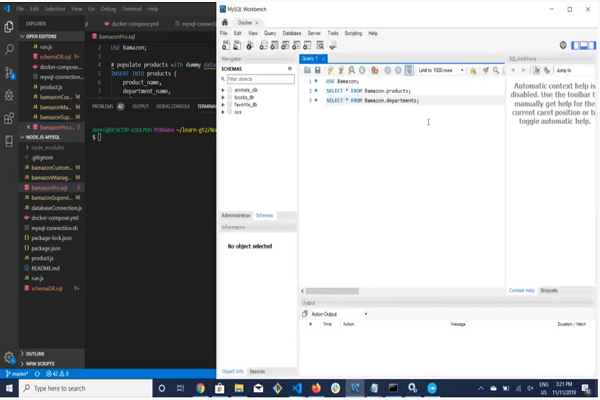

# Node.js-MySQL

# Functions

- Bamazon is an Amazon-like storefront application that runs on a command line interface.

- The app will take in orders from customers and deplete stock from the store's inventory.

- This app tracks product sales across store's departments and then provide a summary of the highest-grossing departments in the store.

# Technologies

- Languages.

    * Node.js
    * JavaScript
    * ES6, NPM (Node Package Manager)
    * docker-compose.yml
    * mysql.sh
    * .gitignore

- Database. 

    * Docker
    * MySQL 

# Demostration

- Click on the image below that links to the video of my Bamazon App demo.

- These Gif images displays the product total profit sales by department.

    

    